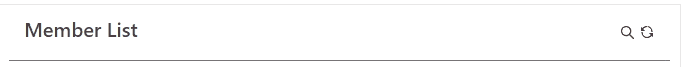

[← Back to main page][main-page]

# AimoSearchBar

**AimoSearchBar** is search input with accordion animation for React.

<div style="text-align: center">


</div>

## Contents

- [Install](#install)
- [Use](#use)
- [API](#api)
- [License](#license)

## Install

To install **AimoSearchBar** package in react (requires react >= 18.0.0), you can use [yarn][]:

```sh
yarn add @aimo.ui/aimo-searchbar
```

or [npm][]:

```sh
npm install @aimo.ui/aimo-searchbar
```

## Use

In order to use **AimoSearchBar** component, you should import it using:

```js
import AimoSearchBar from "@aimo.ui/aimo-searchbar";
```

Following example shows how you can easily use `<AimoSearchBar>` component in your code:

```js
...
const App= () => {
  ...
  return (
    <div  className="appBody">
      ...
      <AimoSearchBar onChange={(text) => handleSearch(text)} />
      ...
    </div>
  );
};
```

Also you can check out [**Aimo-SearchBar Sample Usage Code**][demo-searchbar] for more advanced usage example.

## API

Below is the list of all the props that can be used with `<AimoSearchBar>` component.

| Name               | Type       | Default       | Description                                                                                                 |
| ------------------ | ---------- | ------------- | ----------------------------------------------------------------------------------------------------------- |
| **className**      | `string`   | `null`        | Extra class name for search-bar container                                                                   |
| **iconSide**       | `string`   | `'left'`      | Specify icon position (valid values are `'left'` and `'right'`)                                             |
| **inputClassName** | `string`   | `null`        | Extra class name for search-bar input                                                                       |
| **onChange**       | `function` | `null`        | Callback function for onChange event. input value will be passed to given function.                         |
| **onSearch**       | `function` | `null`        | Callback function to be called when user presses `Enter` key. input value will be passed to given function. |
| **placeholder**    | `string`   | `'search...'` | Placeholder of the search-bar input                                                                         |
| **renderIcon**     | `function` | `null`        | Render function to have custom search icon                                                                  |

## License

[MIT][license] © [Mostafa Vahabzadeh][author]

[main-page]: ../README.md
[yarn]: https://yarnpkg.com/cli/add
[npm]: https://docs.npmjs.com/cli/install
[demo-searchbar]: ../src/demo/DemoSearchBar/DemoSearchBar.jsx
[license]: ../LICENSE
[author]: https://github.com/vah-most
