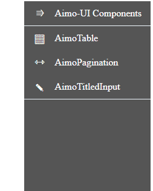

[← Back to main page][main-page]

# AimoSideMenu

**AimoSideMenu** is a fully-controllable side-menu component for React. It supports right-to-left view, and gives you full control to pass extra css classes for different sections and define and use you own render functions for your customized view.

<div style="text-align: center">

</div>

## Contents

- [Install](#install)
- [Use](#use)
- [API](#api)
- [License](#license)

## Install

To install **AimoSideMenu** package in react (requires react >= 18.0.0), you can use [yarn][]:

```sh
yarn add @aimo.ui/aimo-sidemenu
```

or [npm][]:

```sh
npm install @aimo.ui/aimo-sidemenu
```

## Use

In order to use **AimoSideMenu** component, you should import it using:

```js
import AimoSideMenu from "@aimo.ui/aimo-sidemenu";
```

Following example shows how you can use `<AimoSideMenu>` component in your code:

```js
...
    <AimoSideMenu
        headerText="Example Menu"
        menuItems={[
            {
                text: "First Menu Item",
                onClick: () => { ... }
            },
            {
                text: "Second Menu Item",
                onClick: () => { ... }
            },
            {
                text: "Third Menu Item",
                onClick: () => { ... }
            },
            {
                isSeparator: true,
            }
        ]}
      />
...
```

Also you can check out [**Aimo-SideMenu Sample Usage Code**][demo-sidemenu] for more advanced usage example.

## API

Below is the list of all the props that we can use with `<AimoSideMenu>` component.

| Name                       | Type       | Default  | Description                                                                                                                                                                                                                                                          |
| -------------------------- | ---------- | -------- | -------------------------------------------------------------------------------------------------------------------------------------------------------------------------------------------------------------------------------------------------------------------- |
| **compactView**            | `boolean`  | `true`   | Initial / Currrent compact-view state                                                                                                                                                                                                                                |
| **containerClassName**     | `string`   | `''`     | Extra class name for Side-Menu container                                                                                                                                                                                                                             |
| **headerClassName**        | `string`   | `''`     | Extra class name for menu header                                                                                                                                                                                                                                     |
| **headerPosition**         | `string`   | `'top'`  | Specify header position (valid values are `'top'` and `'bottom'`)                                                                                                                                                                                                    |
| **headerText**             | `string`   | `'Menu'` | Menu title text                                                                                                                                                                                                                                                      |
| **hideCompactView**        | `boolean`  | `false`  | Whether to hide compact view (icons-only view)                                                                                                                                                                                                                       |
| **hideHeader**             | `boolean`  | `false`  | Whether to hide menu title                                                                                                                                                                                                                                           |
| **hideIcons**              | `boolean`  | `false`  | Whether to hide menu icons                                                                                                                                                                                                                                           |
| **iconContainerClassName** | `string`   | `''`     | Extra class name for each menu-item icon                                                                                                                                                                                                                             |
| **menuItemClassName**      | `string`   | `''`     | Extra class name for each menu-item                                                                                                                                                                                                                                  |
| **menuItems**              | `array`    | `[]`     | **Required.** Array of menu-item objects. See below for avaiable properties of menu-item objects                                                                                                                                                                     |
| **renderHeaderIcon**       | `function` | `null`   | Replace the render function of header icon. Two arguments values will be sent to given `renderHeaderIcon` function. `isCompact`: a boolean value which tells if compact view is enabled and `toggleCompact`: a function which can be used to toggle the compact view |
| **renderHeaderText**       | `function` | `null`   | Replace the render function of header text. Passing this property overrides setting `headerText`.                                                                                                                                                                    |
| **renderSeparator**        | `function` | `null`   | Replace the render function of separator line.                                                                                                                                                                                                                       |
| **rtl**                    | `boolean`  | `null`   | Whether to display menu-items and accordion effect in right-to-left direction                                                                                                                                                                                        |
| **textContainerClassName** | `string`   | `null`   | Extra class name for each menu-item text                                                                                                                                                                                                                             |

**menuItems** property is an array of objects with the following properties:

| Name            | Type       | Default | Description                                                                                                                                                               |
| --------------- | ---------- | ------- | ------------------------------------------------------------------------------------------------------------------------------------------------------------------------- |
| **isSeparator** | `boolean`  | `false` | Display a separator line after last item                                                                                                                                  |
| **onClick**     | `function` | `null`  | Function to call when user clicks on menu-item                                                                                                                            |
| **text**        | `string`   | `null`  | Menu-item text                                                                                                                                                            |
| **renderFunc**  | `function` | `null`  | Render function for displaying the whole item row. three arguments (`item`, `index`, `compact`) will be sent to given function to help conditional rendering of the item. |
| **renderIcon**  | `function` | `null`  | Render function for displaying icon of the menu-item                                                                                                                      |
| **renderText**  | `function` | `null`  | Render function for displaying text of the menu-item. Setting one of `text` or `renderText` properties is required.                                                       |

## License

[MIT][license] © [Mostafa Vahabzadeh][author]

[main-page]: ../README.md
[yarn]: https://yarnpkg.com/cli/add
[npm]: https://docs.npmjs.com/cli/install
[demo-sidemenu]: ../src/demo/MainPage.jsx
[license]: ../LICENSE
[author]: https://github.com/vah-most
