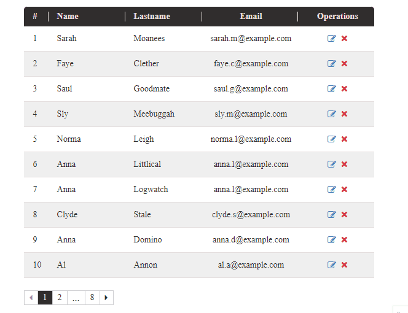

[← Back to main page][main-page]

# AimoTable

**AimoTable** is a component to display tables in React. It's easy to use to gives you full control to customize the way data is being displayed the way you like.

<div style="text-align: center">

</div>

## Contents

- [Install](#install)
- [Use](#use)
- [API](#api)
- [License](#license)

## Install

To install **AimoTable** package in react (requires react >= 18.0.0), you can use [yarn][]:

```sh
yarn add @aimo.ui/aimo-table
```

or [npm][]:

```sh
npm install @aimo.ui/aimo-table
```

## Use

In order to use **AimoTable** component, you should import it using:

```js
import AimoTable from "@aimo.ui/aimo-table";
```

Following example shows how you can use `<AimoTable>` component in your code:

```js
...
      <AimoTable
        columnProps={demoColumnProps}
        data={data}
        operationCellClassName="itemCell"
        operationHeaderClassName="columnHeader operationColumnHeader"
        sortedBy={sortedBy}
        sortedDirAsc={sortedDirAsc}
        onSort={handleSort}
        className="demoTable"
      />
...
```

## API

Below is the list of all the props that we can use with `<AimoTable>` component.

| Name                         | Type       | Default | Description                                                                                                                                                                                                                                                               |
| ---------------------------- | ---------- | ------- | ------------------------------------------------------------------------------------------------------------------------------------------------------------------------------------------------------------------------------------------------------------------------- |
| **className**                | `string`   | `''`    | Extra class name for table container                                                                                                                                                                                                                                      |
| **columnProps**              | `object`   | `{}`    | **Required.** Object containing properties for each visible column                                                                                                                                                                                                        |
| **data**                     | `array`    | `[]`    | **Required.** Array containing data to be shown. Each array cell is an object with keys as introduced in `columnProps` property.                                                                                                                                          |
| **disableDeleteOperation**   | `boolean`  | `false` | Whether to remove `delete` button for each row                                                                                                                                                                                                                            |
| **disableEditOperation**     | `boolean`  | `false` | Whether to remove `edit` button for each row                                                                                                                                                                                                                              |
| **onPageChange**             | `function` | `null`  | Callback function for onPageChange event (Applies only when `renderPagination` is `null` and table uses its own pagination component). `selected-page` will be sent to given function.                                                                                    |
| **onRequestDelete**          | `function` | `null`  | function to be called for delete-button click event. Respective `data` cell will be sent to given function.                                                                                                                                                               |
| **onRequestEdit**            | `function` | `null`  | function to be called for edit-button click event. Respective `data` cell will be sent to given function.                                                                                                                                                                 |
| **onSort**                   | `function` | `null`  | function to be called when user clicks on any of `clickable` column headers. Two arguments values will be sent to given function. `fieldName`: name of the column by which sorting should be done, and `sortedDirAsc`: whether sorting should be done in ascending order. |
| **operationCellClassName**   | `string`   | `''`    | Extra class name for operation column cells (if exists)                                                                                                                                                                                                                   |
| **operationHeaderClassName** | `string`   | `''`    | Extra class name for operation column header (if exists)                                                                                                                                                                                                                  |
| **renderPagination**         | `function` | `null`  | Render function to have custom pagination component. By default, `AimoTable` uses its own pagination component. `page-count` number will be sent to given function.                                                                                                       |
| **rowClassName**             | `string`   | `''`    | Extra class name for each table row                                                                                                                                                                                                                                       |
| **rowsPerPage**              | `number`   | `10`    | Maximum number of rows to be shown on each page                                                                                                                                                                                                                           |
| **showPagination**           | `boolean`  | `true`  | Whether to render pagination below the table                                                                                                                                                                                                                              |
| **sortedBy**                 | `string`   | `null`  | Name of the field by which sorting was done                                                                                                                                                                                                                               |
| **sortedDirAsc**             | `boolean`  | `true`  | Whether sorting was done in ascending order                                                                                                                                                                                                                               |

**columnProps** property is an objects consisting of all the field names as keys and all the properties of each field as an object. These are the valid properties of each field:

| Name                | Type       | Default | Description                                                                                                                                    |
| ------------------- | ---------- | ------- | ---------------------------------------------------------------------------------------------------------------------------------------------- |
| **cellClassName**   | `string`   | `''`    | Extra class name for each cell containing this field                                                                                           |
| **headerClassName** | `string`   | `''`    | Extra class name for this field's header                                                                                                       |
| **headerTitle**     | `string`   | `''`    | Title of this field's column header                                                                                                            |
| **isSortable**      | `boolean`  | `false` | Whether table can be sorted by this field                                                                                                      |
| **renderFunc**      | `function` | `null`  | Render function for displaying each table cell containing this field. corresponding data row will be sent to given function as input argument. |

## License

[MIT][license] © [Mostafa Vahabzadeh][author]

[main-page]: ../README.md
[yarn]: https://yarnpkg.com/cli/add
[npm]: https://docs.npmjs.com/cli/install
[license]: ../LICENSE
[author]: https://github.com/vah-most
