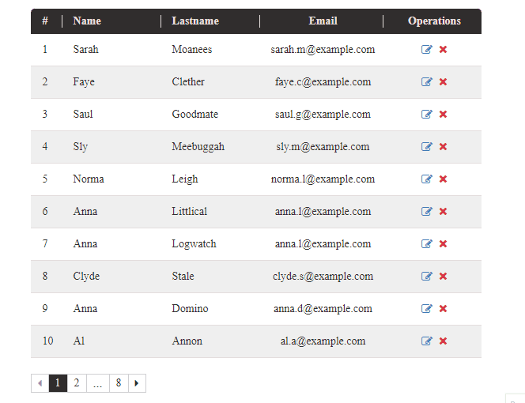

[← Back to main page][main-page]

# AimoTable

**AimoTable** is a component to display tables in React. It's easy to use and gives you full control to customize the way data is being displayed the way you like. It also has many useful builtin modules, like sort, pagination, search, tooltip, etc.

<div style="text-align: center">


</div>

## Contents

- [Install](#install)
- [Use](#use)
- [API](#api)
- [License](#license)

## Install

To install **AimoTable** package in react (requires react >= 18.0.0), you can use [yarn][]:

```sh
yarn add @aimo.ui/aimo-table
```

or [npm][]:

```sh
npm install @aimo.ui/aimo-table
```

## Use

In order to use **AimoTable** component, you should import it using:

```js
import AimoTable from "@aimo.ui/aimo-table";
```

Following example shows how you can use `<AimoTable>` component in your code:

```js
...
  <AimoTable
    autoAddRowNumbers={true}
    columnProps={{
      name: { headerTitle: "Name" },
      credit: { headerTitle: "Credit", isSortable: true },
    }}
    data={[
      { name: "Olive Yew", credit: 54 },
      { name: "Aida Bugg", credit: 135 },
      { name: "Maureen Biologist", credit: 23 },
      { name: "Teri Dactyl", credit: -12 },
      { name: "Peg Legge", credit: 453 },
      { name: "Allie Grater", credit: 0 },
    ]}
  />
...
```

Also you can check out [**Aimo-Table Sample Usage Code**][demo-table] for more advanced usage example.

## API

Below is the list of all the props that we can use with `<AimoTable>` component.

| Name                                | Type       | Default | Description                                                                                                                                                                                                                                                                                                                                                         |
| ----------------------------------- | ---------- | ------- | ------------------------------------------------------------------------------------------------------------------------------------------------------------------------------------------------------------------------------------------------------------------------------------------------------------------------------------------------------------------- |
| **autoAddRowNumbers**               | `boolean`  | `false` | Whether to automatically add number (`#`) column for each row. Appliable **only if** component's built-in sort is enabled (`onSort` property is not set)                                                                                                                                                                                                            |
| **cellClassName**                   | `string`   | `''`    | Extra class name for each data cell                                                                                                                                                                                                                                                                                                                                 |
| **className**                       | `string`   | `''`    | Extra class name for table container                                                                                                                                                                                                                                                                                                                                |
| **cellContentClassName**            | `string`   | `''`    | Extra class name for content of each data cell                                                                                                                                                                                                                                                                                                                      |
| **columnProps**                     | `object`   | `{}`    | **Required.** Object containing properties for each visible column                                                                                                                                                                                                                                                                                                  |
| **data**                            | `array`    | `[]`    | **Required.** Array containing data to be shown. Each array cell is an object with keys as introduced in `columnProps` property.                                                                                                                                                                                                                                    |
| **disableDeleteOperation**          | `boolean`  | `true`  | Whether to remove `delete` button for each row                                                                                                                                                                                                                                                                                                                      |
| **disableEditOperation**            | `boolean`  | `true`  | Whether to remove `edit` button for each row                                                                                                                                                                                                                                                                                                                        |
| **disableExportOperation**          | `boolean`  | `true`  | Whether to remove `export` button of the table                                                                                                                                                                                                                                                                                                                      |
| **disableRefreshOperation**         | `boolean`  | `true`  | Whether to remove `refresh` button of the table                                                                                                                                                                                                                                                                                                                     |
| **disableSearchOperation**          | `boolean`  | `true`  | Whether to hide table's builtin `search` input                                                                                                                                                                                                                                                                                                                      |
| **exportFileName**                  | `string`   | `null`  | Custom name for the export file                                                                                                                                                                                                                                                                                                                                     |
| **headerClassName**                 | `string`   | `''`    | Extra class name for header cells                                                                                                                                                                                                                                                                                                                                   |
| **onPageChange**                    | `function` | `null`  | Callback function for onPageChange event (Applies only when `renderPagination` is `null` and table uses its own pagination component). `selected-page` will be sent to given function.                                                                                                                                                                              |
| **onRefresh**                       | `function` | `null`  | Function to be called for refresh-button click event.                                                                                                                                                                                                                                                                                                               |
| **onRequestDelete**                 | `function` | `null`  | Function to be called for delete-button click event. Respective `data` cell will be sent to given function.                                                                                                                                                                                                                                                         |
| **onRequestEdit**                   | `function` | `null`  | Function to be called for edit-button click event. Respective `data` cell will be sent to given function.                                                                                                                                                                                                                                                           |
| **onSort**                          | `function` | `null`  | Function to be used instead of component's built-in sorting method. Sorting will be performable on any `sortable` columns (columns with `isSortable` property set to `true`). Two arguments will be sent to given function. `fieldName`: name of the column by which sorting should be done, and `sortedDirAsc`: whether sorting should be done in ascending order. |
| **operationCellClassName**          | `string`   | `''`    | Extra class name for operation column cells (if exists)                                                                                                                                                                                                                                                                                                             |
| **operationHeaderClassName**        | `string`   | `''`    | Extra class name for operation column header (if exists)                                                                                                                                                                                                                                                                                                            |
| **paginationDisabledPageClassName** | `string`   | `''`    | Extra class name for builtin pagination's page-number container `<div>` when page is disabled                                                                                                                                                                                                                                                                       |
| **paginationPageClassName**         | `string`   | `''`    | Extra class name for builtin pagination's page-number container `<div>`                                                                                                                                                                                                                                                                                             |
| **paginationSelectedPageClassName** | `string`   | `''`    | Extra class name for builtin pagination's selected page-number container `<div>`                                                                                                                                                                                                                                                                                    |
| **renderEmptyTableText**            | `function` | `null`  | Render function to display desired text when table has no data                                                                                                                                                                                                                                                                                                      |
| **renderPagination**                | `function` | `null`  | Render function to have custom pagination component. By default, `AimoTable` uses [`@aimo.ui/aimo-pagination`][aimo-pagination] component. `page-count` number will be sent to given function.                                                                                                                                                                      |
| **rowClassName**                    | `string`   | `''`    | Extra class name for each table row                                                                                                                                                                                                                                                                                                                                 |
| **rowsPerPage**                     | `number`   | `10`    | Maximum number of rows to be shown on each page                                                                                                                                                                                                                                                                                                                     |
| **showPagination**                  | `boolean`  | `true`  | Whether to render pagination below the table                                                                                                                                                                                                                                                                                                                        |
| **sortedBy**                        | `string`   | `null`  | Name of the field by which sorting was done                                                                                                                                                                                                                                                                                                                         |
| **sortedDirAsc**                    | `boolean`  | `true`  | Whether sorting was done in ascending order                                                                                                                                                                                                                                                                                                                         |
| **title**                           | `string`   | `null`  | Optional text to use as table's title inside header                                                                                                                                                                                                                                                                                                                 |
| **tooltipArrowClassName**           | `string`   | `''`    | Extra class name for the arrow of the builtin tooltip bubble. `AimoTable` uses [`@aimo.ui/aimo-tooltip`][aimo-tooltip] component to show tooltip.                                                                                                                                                                                                                   |
| **tooltipBodyClassName**            | `string`   | `''`    | Extra class name for the body of the builtin tooltip bubble. `AimoTable` uses [`@aimo.ui/aimo-tooltip`][aimo-tooltip] component to show tooltip.                                                                                                                                                                                                                    |
| **tooltipClassName**                | `string`   | `''`    | Extra class name for builtin tooltip bubble container. `AimoTable` uses [`@aimo.ui/aimo-tooltip`][aimo-tooltip] component to show tooltip.                                                                                                                                                                                                                          |

**columnProps** property is an objects consisting of all the field names as keys and all the properties of each field as an object. These are the valid properties of each field:

| Name                     | Type       | Default | Description                                                                                                                                                                                                                                                                                                                                                                    |
| ------------------------ | ---------- | ------- | ------------------------------------------------------------------------------------------------------------------------------------------------------------------------------------------------------------------------------------------------------------------------------------------------------------------------------------------------------------------------------ |
| **cellClassName**        | `string`   | `''`    | Extra class name for each cell containing this field                                                                                                                                                                                                                                                                                                                           |
| **cellContentClassName** | `string`   | `''`    | Extra class name for content of each cell containing this field                                                                                                                                                                                                                                                                                                                |
| **headerClassName**      | `string`   | `''`    | Extra class name for this field's header                                                                                                                                                                                                                                                                                                                                       |
| **headerTitle**          | `string`   | `''`    | Title of this field's column header                                                                                                                                                                                                                                                                                                                                            |
| **isSortable**           | `boolean`  | `false` | Whether table can be sorted by this field                                                                                                                                                                                                                                                                                                                                      |
| **renderFunc**           | `function` | `null`  | Render function for displaying each table cell containing this field. corresponding data row will be sent to given function as input argument.                                                                                                                                                                                                                                 |
| **renderTooltip**        | `function` | `null`  | Render function for displaying tooltip on hover of items of this field. corresponding data row will be sent to given function as input argument.                                                                                                                                                                                                                               |
| **searchFunc**           | `function` | `null`  | Custom search function to use when search is being performed on this field. Two parameters are being passed to this function: `row` which is the corresponding data row and `search` which is the text that is being searched.                                                                                                                                                 |
| **sortFunc**             | `function` | `null`  | Custom sort function for comparing cells containing this field. Three parameters are being passed to this function: `item1` and `item2` which are item values that have to be compared with eachother, and `dirAsc` which is a boolean value that shows if sorting is in ascending or descending order. return value should be one of (`-1`, `0` and `1`) based on comparison. |

## License

[MIT][license] © [Mostafa Vahabzadeh][author]

[main-page]: ../README.md
[yarn]: https://yarnpkg.com/cli/add
[npm]: https://docs.npmjs.com/cli/install
[demo-table]: ../src/demo/DemoTable/DemoTable.jsx
[aimo-pagination]: ./AimoPagination.md
[aimo-tooltip]: ./AimoTooltip.md
[license]: ../LICENSE
[author]: https://github.com/vah-most
