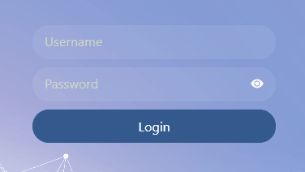
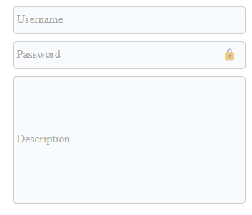

[← Back to main page][main-page]

# AimoTitledInput

**AimoTitledInput** is an input component with sticky title/placeholder on the top. It supports different types of input and text-area. Also for passwords it supports hide/unhide icon to toggle password display.

<div style="text-align: center">


</div>

## Contents

- [Install](#install)
- [Use](#use)
- [API](#api)
- [License](#license)

## Install

To install **AimoTitledInput** package in react (requires react >= 18.0.0), you can use [yarn][]:

```sh
yarn add @aimo.ui/aimo-titledinput
```

or [npm][]:

```sh
npm install @aimo.ui/aimo-titledinput
```

## Use

In order to use **AimoTitledInput** component, you should import it using:

```js
import AimoTitledInput from "@aimo.ui/aimo-titledinput";
```

Following example shows how you can use `<AimoTitledInput>` component in your code:

```js
...
const App= () => {
  ...

  const [username, setUsername] = useState("");

  return (
    <div  className="appBody">
      ...
      <AimoTitledInput
          onChange={(text) => setUsername(text)}
          placeholder="Username"
          value={username}
      />
      ...
    </div>
  );
};
```

Also you can check out [**Aimo-TitledInput Sample Usage Code**][demo-titledinput] for more advanced usage example.

## API

Below is the list of all the props that can be used with `<AimoTitledInput>` component.

| Name                                  | Type       | Default  | Description                                                                                                                                      |
| ------------------------------------- | ---------- | -------- | ------------------------------------------------------------------------------------------------------------------------------------------------ |
| **activeStateClassName**              | `string`   | `null`   | Extra class name for input container when input is active (is focused or not empty)                                                              |
| **activeStatePlaceholderClassName**   | `string`   | `null`   | Extra class name for placeholder when input is active (is focused or not empty)                                                                  |
| **error**                             | `string`   | `null`   | Text to show as input error                                                                                                                      |
| **errorClassName**                    | `string`   | `null`   | Extra class name of the error container                                                                                                          |
| **inactiveStateClassName**            | `string`   | `null`   | Extra class name for input container when input is inactive (is empty and not focused)                                                           |
| **inactiveStatePlaceholderClassName** | `string`   | `null`   | Extra class name for placeholder when input is inactive (is empty and not focused)                                                               |
| **inputClassName**                    | `string`   | `null`   | Extra class name for input container                                                                                                             |
| **inputType**                         | `string`   | `'text'` | One of the standard text-based input types (text, email, password, ...). `textarea` type is also supported for multi-line input.                 |
| **onChange**                          | `function` | `null`   | **Required.** Callback function for onChange event. input value will be passed to given function.                                                |
| **passwordTogglerRenderFunc**         | `function` | `null`   | Render function for displaying password-displayer icon. A boolean value which shows if the password is hidden, will be passed to given function. |
| **placeholder**                       | `string`   | `null`   | Placeholder/Label of the input .                                                                                                                 |
| **showPasswordDisplayIcon**           | `boolean`  | `true`   | Whether to display `password` hide/unhide icon.                                                                                                  |
| **value**                             | `string`   | `null`   | **Required.** Input value                                                                                                                        |

## License

[MIT][license] © [Mostafa Vahabzadeh][author]

[main-page]: ../README.md
[yarn]: https://yarnpkg.com/cli/add
[npm]: https://docs.npmjs.com/cli/install
[demo-titledinput]: ../src/demo/DemoTitledInput/DemoTitledInput.jsx
[license]: ../LICENSE
[author]: https://github.com/vah-most
